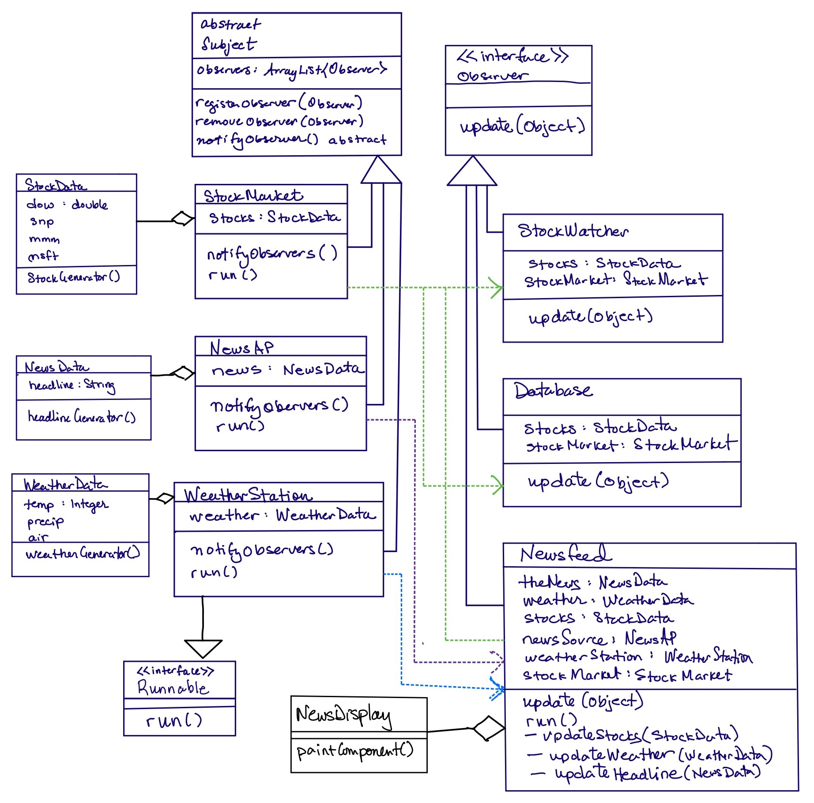

### Lab 04 The Observer Pattern But Better

In this lab, you will continue to work on your Observer Pattern code to improve the design and to enhance the functionality. Feel free to make this your own, for example you can make different subjects and observers; change the data associated with the given subjects; and display in the graphics window in any way you like. There are certain requirements of the code that must be met, which are detailed below. You are also required to do a little digging around on the web to learn something new and report on it.

There are a lot of classes to keep track of. Think carefully about naming and organizing classes. I regret some of my choices and might go back and rename things!

You can work with 1 other person to develop this code. It would be a good opportunity for you to practice team development using a repo. Even if you work alone, it is a good idea to maintain a repo as a form of back-up. 

<hr>

### THE STRUCTURE



<hr>

#### SUBJECTS

All Subjects should inherit from `abstract class Subject`. I made this an abstract class because there was a lot of shared code among all subjects, but a Subject should never be instantiated. In my code, `registerObserver(Observer)` and `removeObserver(Observer)` are implemented in the abstract class -- no need to override in subclasses. The method `abstract notifyObservers()` has no implementation in the Subject class and must be implemented in each of the Subject subclasses. 

In my code, each concrete Subject class implements the `interface Runnable` so that each subject is generating new data and different frequencies using a `while(true)` with `Thread.sleep()` in `run()`. In the concrete classes, `notifyObservers` is called in `run()`, and the `notifyObservers()` generates the associated data.

Every Subject has an associated Data class, which is what is passed when it calls `observer.update(Object)`. This is what facilitates the generic Subject and Observer from which all concrete subjects and observers are derived.

**STOCKS**. One thing that observers can watch is the stock market. The information available includes the Dow Jones and S&P 500 indices, and the 3M and Microsoft stock price. In the real-world, this information would be tied to the web. In this code, it is randomly generated at a rate specified within the `run()` method.

**WEATHER**. Another thing that observers can watch is Minneapolis weather. The information available includes the temparature, chance of precipiation (in %), and air quality index. Again, this is being randomly generated to simulate updates at a rate specified within the `run()` method.

**HEADLINES**. A new subject `NewsAP` is simulated headlines from the Associated Press.

#### OBSERVERS

All Observers should inherit from `interface Observer`. The only method is `update(Object)`. The concrete Observers operate on specific Data objects, which are passed through the update method. The `Object` passed to the update method must be cast to the appropriate Data type (e.g. WeatherData, StockData, NewsData) to access the components of the data.

Here is an example of the Newsfeed Observer update method:

```Java
/* Receiving an update from the subject. */
 public void update(Object data) {
    if (data instanceof StockData) {
        updateStocks((StockData) data);
    } else if (data instanceof WeatherData) {
        updateWeather((WeatherData) data);
    } else if (data instanceof NewsData) {
        updateHeadline((NewsData) data);
    } else {
        // throw an exception is the appropriate thing to do here
    }
}
```

When a Subject updates an Observer with Data, the Subject pushed a **copy** of the Data object (using the copy constructor), rather than the object itself. This keeps the original data encapsulated inside the Subject.

```Java
    for (Observer obs : observers()) {
        obs.update(new StockData(stocks));
    }
```

**NEWS FEED**. The news feed (displayed using a pop-up graphics window) displays updates to the stocks, weather, and the AP news headline. You may choose to display all of the information or just some of the information. In my implementation, the `class Newsfeed extends Thread implements Observer`. The newsfeed (i.e. the scrolling headliner) is updated at a rate specified in the `run()` method. The timing controls the scrolling action in the graphics window.

**STOCK WATCHER**. The stock watcher in last week's version displayed in the shell. This week, create a second graphics window (like we did on Tuesday) so that both the News Feed (with stocks, weather, and headlines) and the Stock Watcher are in different pop-up windows.

**DATABASE**. The database (saved in a file) will save the price of 1 stock and both indices. This should have a timestamp for each entry.

<hr>

### Requirements

1. Implement 3 concrete Subject classes that extend `Subject`. All Subjects should be running in a thread. The `run()` method should have an infinite loop. In the loop, there should be `Thread.sleep(ms)` that controls the timing of notifying its observers.

1. Implement 3 concrete Observer classes that implement `Observer`.

1. At least 1 of the Observers should observe multiple Subjects.

1. At least 1 of the Observers should display in a pop-up graphics window.

1. Observers should NOT print in the shell. Use another graphics window or some other form of displaying or saving the information.

1. At least one of the Observers should extend `Thread` or implement `Runnable` so that the timing of the use of the observed data is different from the timing that the data is updated. For example, my newsfeed runs in a thread that runs far more frequently than NewsAP pushes out a new headline.

1. Learn something new! Think about something that you would like your program to do that you currently do not know how to do. Or maybe there is a tool that you want to learn to use that helps design, develop, or test code. Find some information on the web. Ask around. And learn how to do it. For example, you could display an up or down arrow image with each stock value to indicate it is going up or going down. You can try to do the scrolling headline. Maybe you can connect a Subject to the web and get realtime data. Maybe you can graph data out of the database (this could happen in another program that is running perhaps even in another language). 

__What you learn should be relatively substantial. For example, googling how to get a real-time timestamp is not substantial. Learning how to display different types of objects in different colors at different locations is substantial.__

### Deliverables

1. The Code.

1. Provide a general overview of your code structure. You can use a UML diagram or describe it or some combination.

1. Explain what you learned. In this explanation, provide an overview of the topic/skill, the resources that you used, and how you used that new skill in your code.

1. If you worked with another person, provide the repo URL. If you didn't collaborate using a repo, describe who was responsible for which piece.

 


